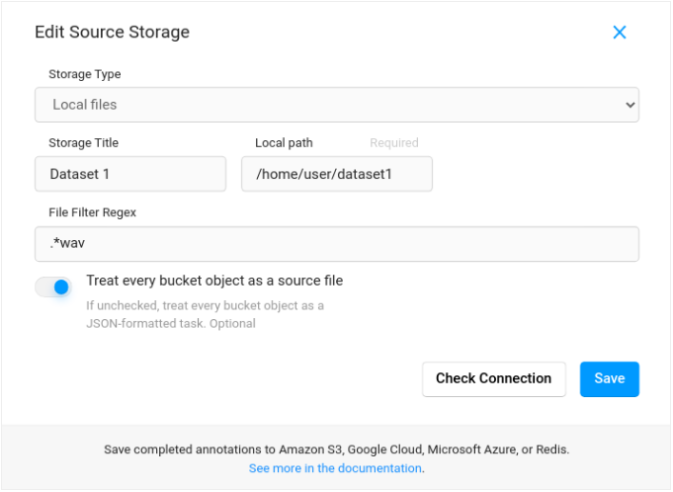

# Prelabling for OCR task

## 1. Environment preparation

```bash
sudo apt-get install poppler-utils
```

```bash
pip3 install -r requirements.txt
```

### install fasttext

```bash
wget https://dl.fbaipublicfiles.com/fasttext/supervised-models/lid.176.bin
wget https://github.com/facebookresearch/fastText/archive/v0.9.2.zip
unzip v0.9.2.zip
cd fastText-0.9.2
make
pip install .
cd ..
```

## 2. Model conversion

### Paddle detection model download

```bash
wget -nc -P ./inference https://paddleocr.bj.bcebos.com/PP-OCRv3/english/en_PP-OCRv3_det_infer.tar

cd ./inference && tar xf en_PP-OCRv3_det_infer.tar && cd ..
```

### Paddle detection Convert ONNX

```bash
paddle2onnx --model_dir ./inference/en_PP-OCRv3_det_infer \
--model_filename inference.pdmodel \
--params_filename inference.pdiparams \
--save_file ./onnx/detection.onnx \
--opset_version 12 \
--input_shape_dict="{'x':[-1,3,-1,-1]}" \
--enable_onnx_checker True
```


### Paddle recongnizer model download

```bash
wget -nc -P ./inference https://paddleocr.bj.bcebos.com/PP-OCRv3/english/en_PP-OCRv3_rec_infer.tar

cd ./inference && tar xf en_PP-OCRv3_rec_infer.tar && cd ..
```

### Paddle recongnizer Convert ONNX

```bash
paddle2onnx --model_dir inference/en_PP-OCRv3_rec_infer \
--model_filename inference.pdmodel \
--params_filename inference.pdiparams \
--save_file onnx/Recognizer.onnx \
--opset_version 12 \
--input_shape_dict="{'x':[-1,3,-1,-1]}" \
--enable_onnx_checker True
```

```bash
rm -rf ./inference
```


## 3. How predict box and text image to import

1. Copy file pdf to [pdf](./pdf)
2. Run
```bash 
python3 new_infer.py
```

## 4. How to label

### install tool 
```python
pip install label-studio
```

### Set env variabel

```bash
export LABEL_STUDIO_LOCAL_FILES_SERVING_ENABLED=true
export LABEL_STUDIO_LOCAL_FILES_DOCUMENT_ROOT=/home/yourname/nvmanh-git/label-studio-ocr-backend
```
### Set local storage

1. run label-studio on http://localhost:8080/
```python
label-studio
```
---
2. create project OCR and add list of label in file [label.txt](label.txt)

---
3. Open settings -> Cloud Storage.
- **Storage Type -> Local files**
- **Storage title**: ImageData
- **Storage path**: /home/yourname/nvmanh-git/label-studio-ocr-backend/imgs


> you need change path to correct with you:
> 
> **LABEL_STUDIO_LOCAL_FILES_DOCUMENT_ROOT**:   is the path to the parent directory
>
> **Storage path**:  is the path to the subdirectory where your image stored

### Import file json and start labeling
